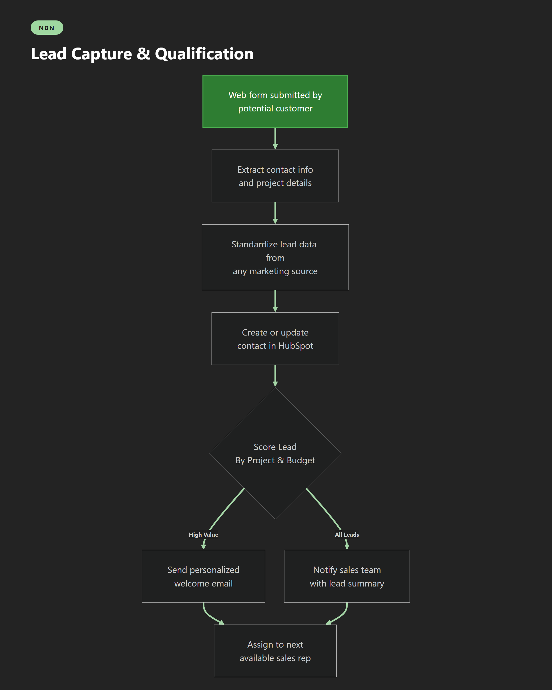
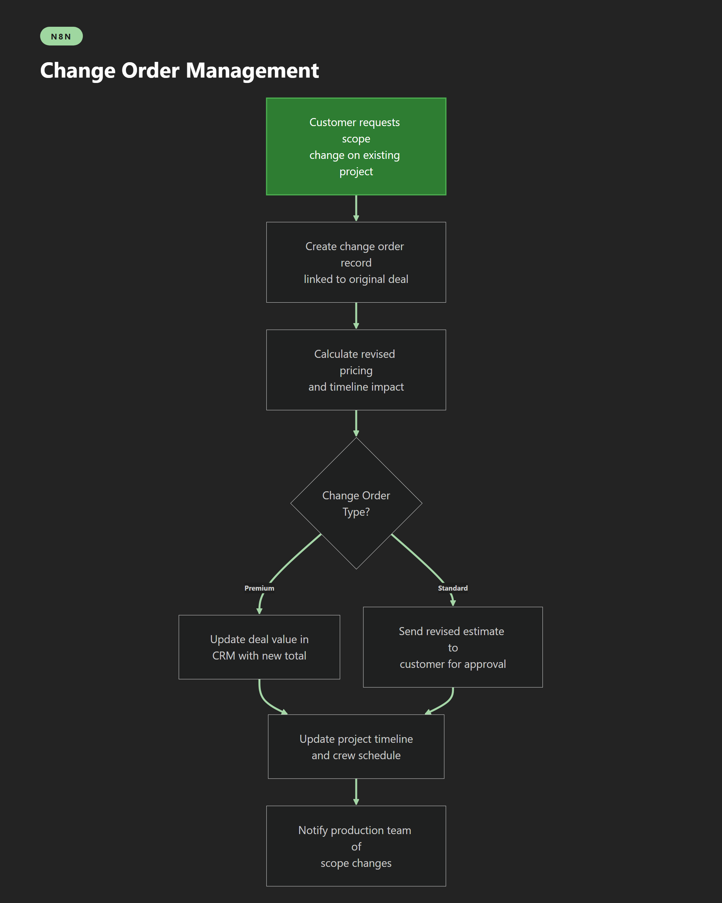
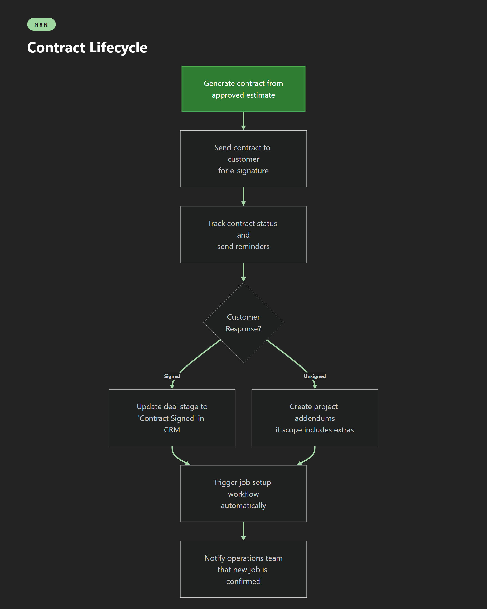
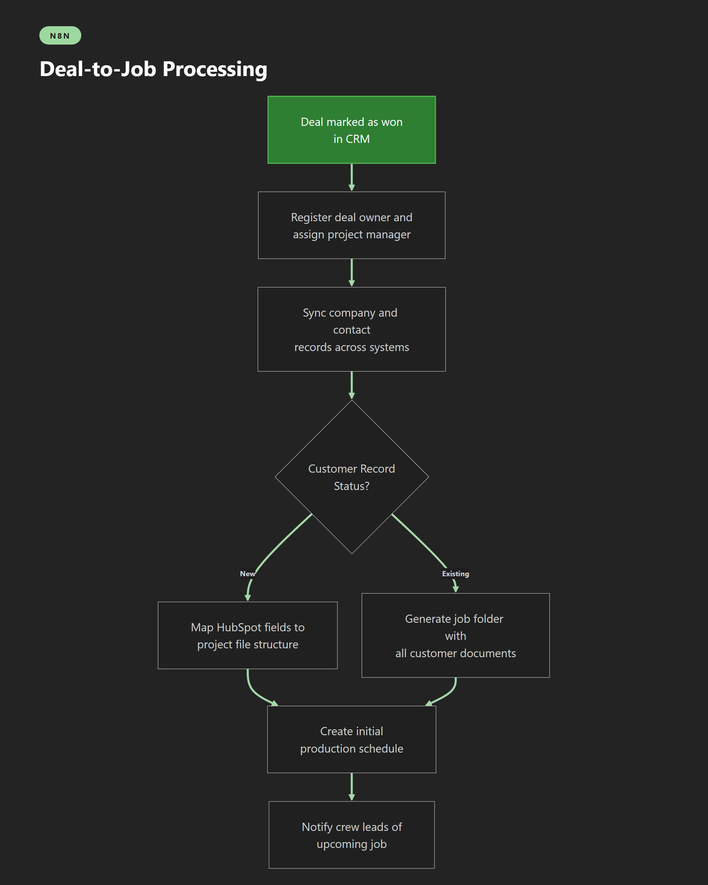
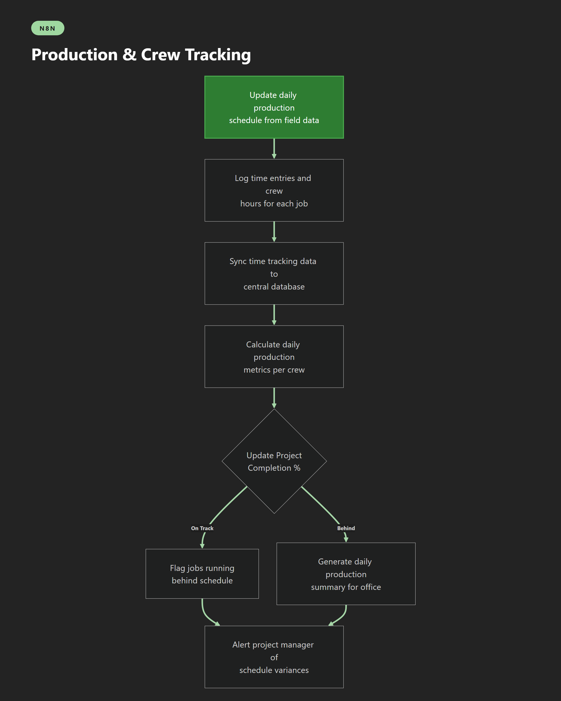
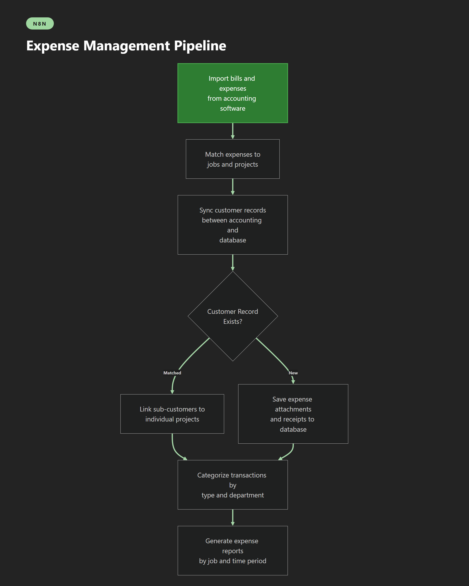
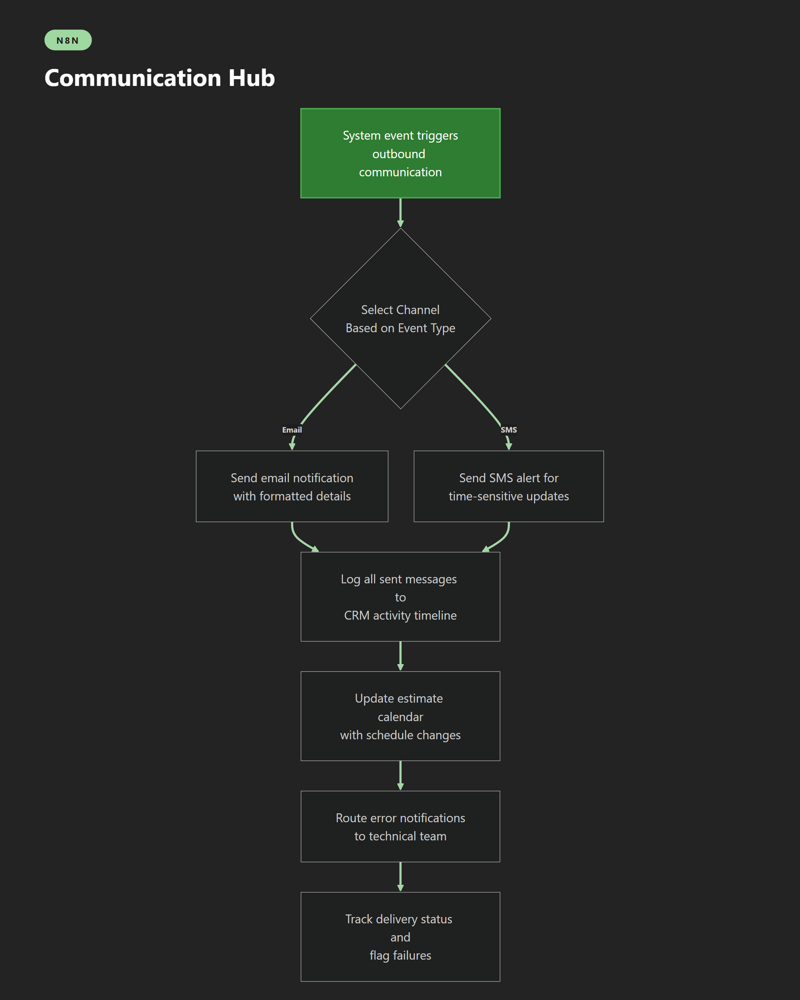

# LinkedIn Automation Portfolio

This portfolio showcases real home service operational processes reimagined as modern automation workflows. Each post demonstrates how complex business processes can be streamlined using Make, Zapier, or n8n — transforming manual operations into automated systems that run 24/7.

**Core Value:** Every post is a standalone, compelling showcase of a real automation process that makes you think "I need something like this" or "this person really knows automation."

Each process is presented in three platform versions (Make, Zapier, n8n) — same narrative structure and business logic, just swapping the automation tool to demonstrate platform flexibility.

## Portfolio Posts

The posts are organized following the customer journey from lead to completed job:

| Journey Stage | Post | Preview | Platforms | Description |
|---------------|------|---------|-----------|-------------|
| **Lead Capture** | Lead Capture & Qualification |  | [Make](posts/01-lead-capture/lead-capture-make.md) · [Zapier](posts/01-lead-capture/lead-capture-zapier.md) · [n8n](posts/01-lead-capture/lead-capture-n8n.md) | Sales reps manually copying form submissions into the CRM, missing hot leads during evenings and weekends, inconsistent follow-up timing costing deals Every lead is captured instantly from any marketing channel, scored automatically, welcomed within 60 seconds, and routed to the right salesperson — even at 2am on a Sunday |
| **Appointment Booking** | Appointment Booking & Scheduling |  | [Make](posts/02-appointment-booking/appointment-booking-make.md) · [Zapier](posts/02-appointment-booking/appointment-booking-zapier.md) · [n8n](posts/02-appointment-booking/appointment-booking-n8n.md) | Phone tag with customers trying to schedule estimates, double-booked calendars, no-shows because reminders were forgotten, and hours lost to manual calendar management Customers book their own appointments from a personalized link, get automatic confirmations and reminders, and the whole team stays in sync without a single phone call |
| **Estimating** | Estimate-to-Deal Pipeline |  | [Make](posts/03-estimate-to-deal/estimate-to-deal-make.md) · [Zapier](posts/03-estimate-to-deal/estimate-to-deal-zapier.md) · [n8n](posts/03-estimate-to-deal/estimate-to-deal-n8n.md) | Estimates sitting in one tool while deals live in another, sales managers manually copying numbers between systems, inconsistent deal naming making pipeline reports useless The moment an estimate is created, every system updates automatically — the CRM deal is created, named consistently, and the sales team sees real-time pipeline value without touching a spreadsheet |
| **Sales/Proposal** | Change Order Management |  | [Make](posts/04-change-orders/change-orders-make.md) · [Zapier](posts/04-change-orders/change-orders-zapier.md) · [n8n](posts/04-change-orders/change-orders-n8n.md) | Change orders scribbled on paper, forgotten price adjustments that eat into margins, crew showing up without knowing the scope changed, and deals stuck showing the wrong value for weeks Every change order flows through automatically — pricing updates, the CRM reflects the real deal value, and the production team knows about scope changes before they arrive on site |
| **Contract Management** | Contract Lifecycle |  | [Make](posts/05-contract-lifecycle/contract-lifecycle-make.md) · [Zapier](posts/05-contract-lifecycle/contract-lifecycle-zapier.md) · [n8n](posts/05-contract-lifecycle/contract-lifecycle-n8n.md) | Contracts emailed as PDFs, customers printing and scanning to sign, nobody knowing when a contract was actually signed until someone checks email, and jobs delayed waiting for paperwork Contracts go out with one click, customers sign on their phone, and the moment ink hits the digital page the entire back office starts spinning up the job — zero waiting, zero chasing |
| **Job Setup** | Deal-to-Job Processing |  | [Make](posts/06-deal-to-job/deal-to-job-make.md) · [Zapier](posts/06-deal-to-job/deal-to-job-zapier.md) · [n8n](posts/06-deal-to-job/deal-to-job-n8n.md) | Won deals sitting in the CRM while the ops team manually creates job records, copy-pasting customer info between three different systems, and new jobs falling through the cracks during busy season The moment a deal is won, every downstream system is populated automatically — job records, customer files, production schedules, and crew notifications happen without anyone lifting a finger |
| **Production Tracking** | Production & Crew Tracking |  | [Make](posts/07-production-tracking/production-tracking-make.md) · [Zapier](posts/07-production-tracking/production-tracking-zapier.md) · [n8n](posts/07-production-tracking/production-tracking-n8n.md) | Office staff calling crews for updates, production data trapped in text messages and phone calls, no idea which jobs are on track until someone drives to the site, and weekly reports that are already outdated Field crews log production data once, and the entire office sees real-time progress — schedule variances trigger alerts automatically, and daily summaries write themselves |
| **Time Tracking** | Time Tracking Sync Engine |  | [Make](posts/08-time-tracking/time-tracking-make.md) · [Zapier](posts/08-time-tracking/time-tracking-zapier.md) · [n8n](posts/08-time-tracking/time-tracking-n8n.md) | Time entries in one app, job codes in another, payroll staff spending hours reconciling who worked where, deleted entries causing phantom hours, and new employees waiting days to be set up in the time system Every clock-in, correction, and deletion flows between systems in real-time — job codes stay current, employee profiles sync automatically, and payroll gets clean data without manual reconciliation |
| **Invoicing** | Invoice Lifecycle |  | [Make](posts/09-invoice-lifecycle/invoice-lifecycle-make.md) · [Zapier](posts/09-invoice-lifecycle/invoice-lifecycle-zapier.md) · [n8n](posts/09-invoice-lifecycle/invoice-lifecycle-n8n.md) | Unbilled work slipping through the cracks, invoices created in one system but invisible in another, customers getting outdated versions, and voided invoices still showing up in project dashboards Unbilled items are detected automatically, invoices flow between accounting and project management in real-time, and every modification syncs everywhere — nothing falls through the cracks |
| **Expense Management** | Expense Management Pipeline |  | [Make](posts/10-expense-management/expense-management-make.md) · [Zapier](posts/10-expense-management/expense-management-zapier.md) · [n8n](posts/10-expense-management/expense-management-n8n.md) | Receipts in email, bills in accounting software, project costs in a spreadsheet — nobody can answer "how much did we spend on that job?" without an hour of digging through three different systems Every bill, receipt, and transaction is automatically matched to its job, categorized, and stored in one place — real-time job costing without the treasure hunt |
| **Reporting** | Reporting Dashboard Sync |  | [Make](posts/11-reporting-sync/reporting-sync-make.md) · [Zapier](posts/11-reporting-sync/reporting-sync-zapier.md) · [n8n](posts/11-reporting-sync/reporting-sync-n8n.md) | Sales managers manually pulling reports from the CRM every Monday, numbers that are already a week old by the time anyone sees them, and no early warning when pipeline health drops Dashboards refresh every two minutes with live CRM data — win rates, revenue trends, and pipeline health are always current, and anomalies trigger alerts before they become problems |
| **Uncategorized** | Communication Hub |  | [Make](posts/12-communication-hub/communication-hub-make.md) · [Zapier](posts/12-communication-hub/communication-hub-zapier.md) · [n8n](posts/12-communication-hub/communication-hub-n8n.md) | Important updates buried in someone's inbox, text messages sent manually that get forgotten during busy days, error notifications that nobody sees, and no record of what was communicated to whom Every system event automatically triggers the right communication on the right channel — emails, texts, calendar updates, and error alerts all fire without human intervention, with full audit trails in the CRM |

## How to Use This Portfolio

**Viewing Posts:** Each post is written in markdown format and can be viewed in any markdown reader, GitHub, VS Code, or your preferred text editor. The posts are fully self-contained — read any one independently.

**Platform Versions:** Each workflow is presented in three platform versions (Make, Zapier, n8n). The narrative and business logic are identical; only the automation tool changes. Choose the platform version that matches your preferred automation tool.

**Diagrams:** Each post includes a flowchart diagram showing the automation workflow. The PNG diagrams can be downloaded and used in presentations, documentation, or LinkedIn posts. Diagrams are color-coded by platform:
- **Make:** Purple theme
- **Zapier:** Orange theme
- **n8n:** Green theme

**Sharing:** All posts are standalone and shareable. Link directly to individual markdown files or share the entire portfolio.

## Methodology

**Source Material:** These workflows are based on real Prismatic integration YAML exports from an operational home service company. The processes represent actual business operations that ran in production.

**Curation Process:** Raw YAML workflows were analyzed, logical boundaries identified, cross-file connections traced, and processes curated into meaningful business bundles. Each bundle represents a complete business capability (e.g., "Lead Capture & Qualification" or "Invoice Lifecycle").

**Content Generation:** Posts and diagrams were generated programmatically via Claude API using Anthropic's templating system. Each post follows a consistent structure: business context, workflow steps, pain points solved, and technical implementation.

**Diagram Generation:** Flowcharts are generated using Mermaid with platform-specific theming. The diagram generation pipeline lives in the `_pipeline/` subfolder and uses:
- Mermaid syntax for flowchart definitions
- Platform-specific config files for color theming (purple/orange/green)
- mermaid-cli for PNG rendering at retina resolution

**Tool Naming:** Only Make, Zapier, n8n, HubSpot, and Airtable are named explicitly. All other tools use generic labels (e.g., "estimating tool", "time tracking app", "accounting software") to keep posts broadly applicable.

All generation code, templates, and configuration files are preserved in the `_pipeline/` subfolder for reference and reproducibility.

---

*Generated from real operational workflows | Portfolio showcase by [Your Name]*
