# LinkedIn Automation Portfolio

This portfolio showcases real home service operational processes reimagined as modern automation workflows. Each post demonstrates how complex business processes can be streamlined using Make, Zapier, or n8n — transforming manual operations into automated systems that run 24/7.

**Core Value:** Every post is a standalone, compelling showcase of a real automation process that makes you think "I need something like this" or "this person really knows automation."

Each workflow is presented in three platform versions (Make, Zapier, n8n). Post and diagram share one curated narrative spine per bundle — so what you read and what you see tell the same story.

## Portfolio Posts

The posts follow the customer journey from lead to paid invoice, plus two cross-cutting workflows.

| Journey Stage | Post | Preview | Platforms | Description |
|---|---|---|---|---|
| **Lead Capture** | Lead Capture & Qualification | 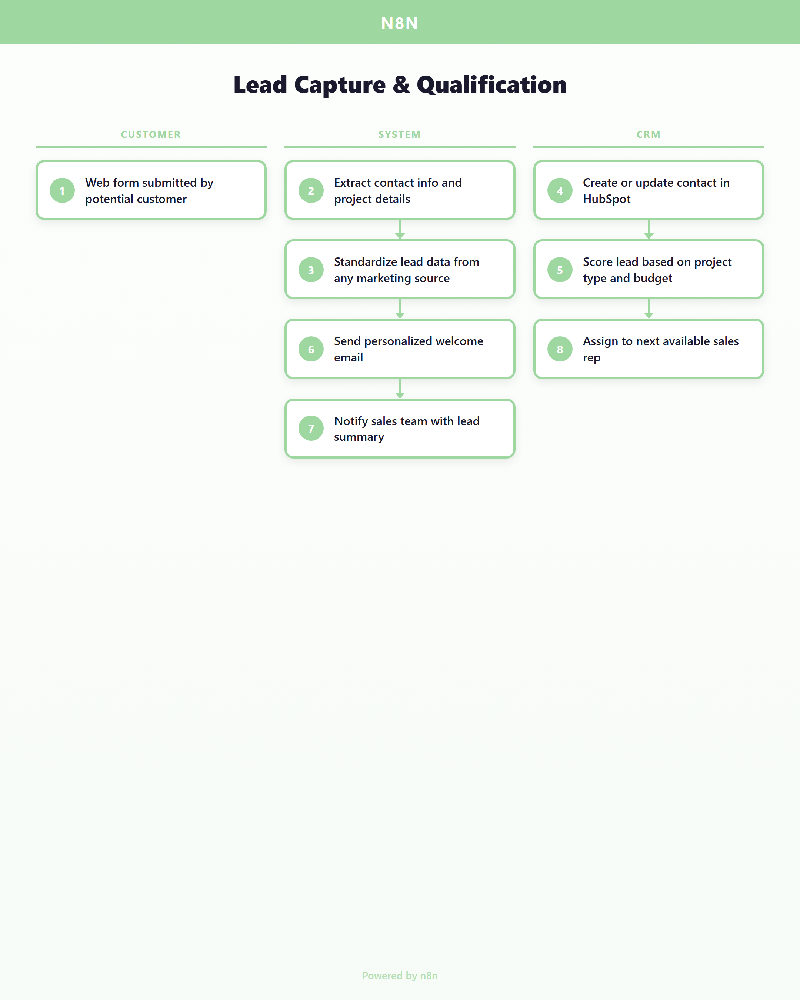 | [Make](posts/lead-capture/make.md) · [Zapier](posts/lead-capture/zapier.md) · [n8n](posts/lead-capture/n8n.md) | Sales reps manually copying form submissions into the CRM, missing hot leads during evenings and weekends, inconsistent follow-up timing costing deals → Every lead is captured instantly from any marketing channel, enriched with project details and marketing source data, and synced to the CRM with deduplicated contacts and deals — even at 2am on a Sunday |
| **Lead Capture** | HubSpot Contact Sync |  | [Make](posts/hubspot-contact-sync/make.md) · [Zapier](posts/hubspot-contact-sync/zapier.md) · [n8n](posts/hubspot-contact-sync/n8n.md) | Sales reps manually searching for contacts before every call, duplicate records piling up in the CRM, and no consistent process for merging contact data from different marketing channels → Every contact is automatically searched by ID and email, merged with existing data if found, or created fresh if new — zero duplicates, zero manual lookups, always the latest info |
| **Appointment Booking** | Appointment Booking & Scheduling | 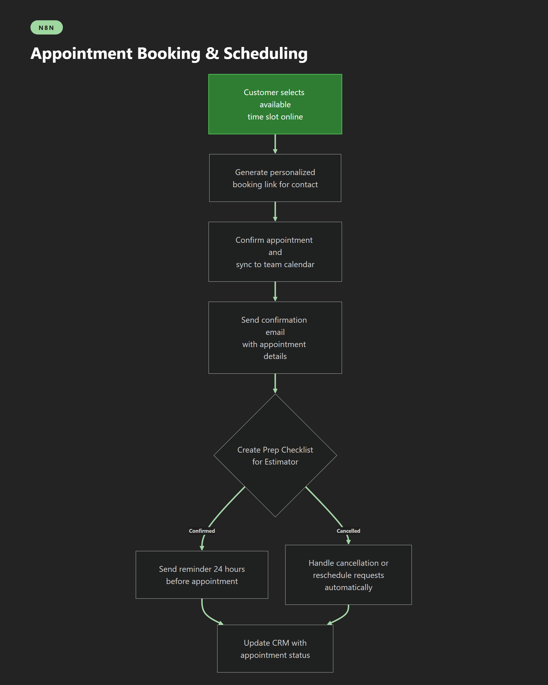 | [Make](posts/appointment-booking/make.md) · [Zapier](posts/appointment-booking/zapier.md) · [n8n](posts/appointment-booking/n8n.md) | Phone tag with customers trying to schedule estimates, double-booked calendars, booking data stuck in one system while the CRM shows something different, and hours lost to manual data entry → Customers book their own appointments and every booking event automatically syncs deal stages and contact records across systems |
| **Estimating** | Estimate-to-Deal Pipeline | 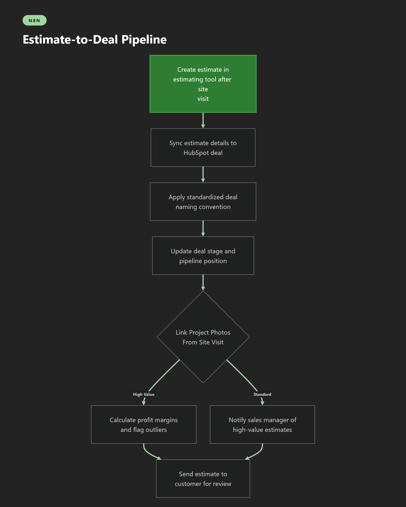 | [Make](posts/estimate-to-deal/make.md) · [Zapier](posts/estimate-to-deal/zapier.md) · [n8n](posts/estimate-to-deal/n8n.md) | Estimates sitting in one tool while deals live in another, sales managers manually copying numbers between systems, inconsistent deal naming making pipeline reports useless → The moment an estimate is created, every system updates automatically — the CRM deal is created, named consistently, and the sales team sees always-current pipeline value |
| **Sales/Proposal** | Change Order Management | 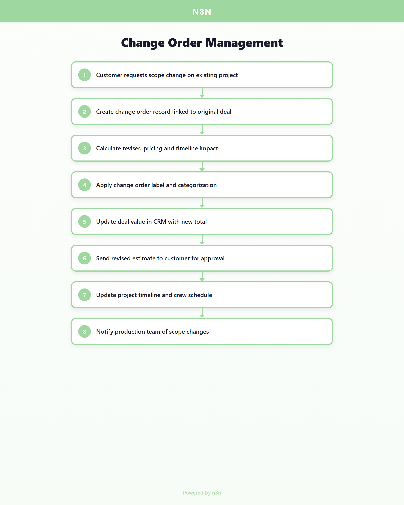 | [Make](posts/change-orders/make.md) · [Zapier](posts/change-orders/zapier.md) · [n8n](posts/change-orders/n8n.md) | Change orders scribbled on paper, forgotten price adjustments that eat into margins, crew showing up without knowing the scope changed, and deals stuck showing the wrong value for weeks → Every change order flows through automatically — deal amounts, hours, labor, materials, and discounts are aggregated across all related deals, and the CRM reflects the real total value |
| **Contract Management** | Contract Lifecycle | 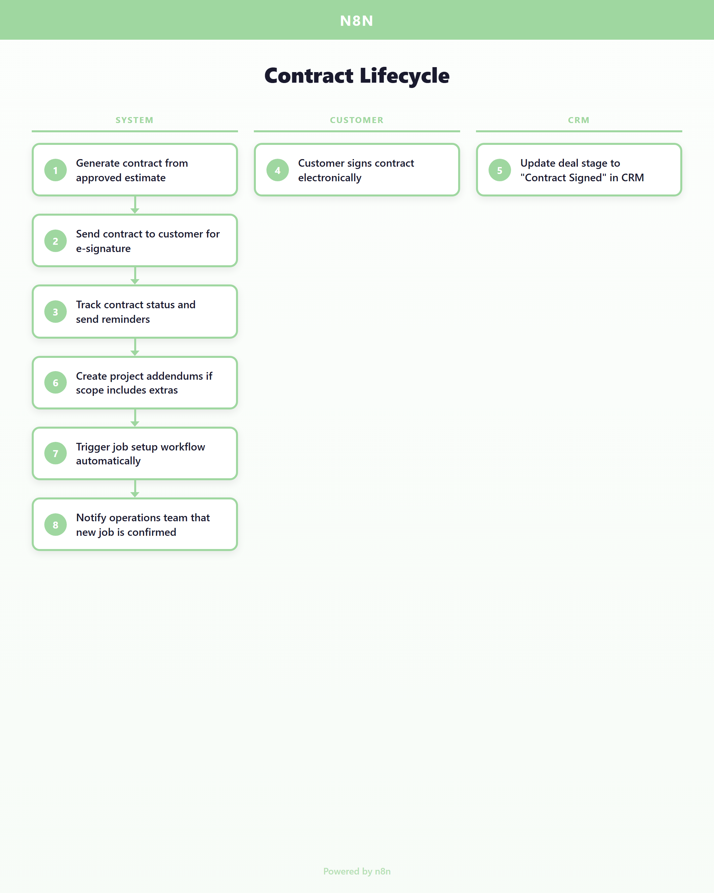 | [Make](posts/contract-lifecycle/make.md) · [Zapier](posts/contract-lifecycle/zapier.md) · [n8n](posts/contract-lifecycle/n8n.md) | Contracts emailed as PDFs, customers printing and scanning to sign, nobody knowing when a contract was actually signed, and jobs delayed waiting for paperwork → Contracts go out with one click, customers sign on their phone, and the moment ink hits the digital page the entire back office starts spinning up the job |
| **Job Setup** | Deal-to-Job Processing | 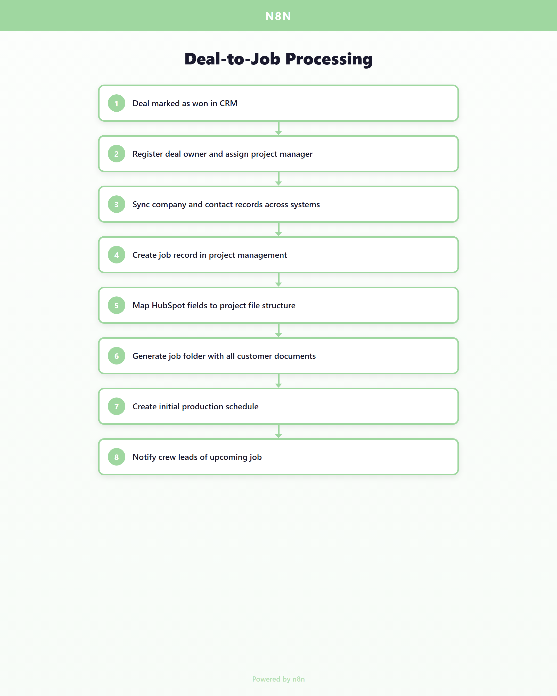 | [Make](posts/deal-to-job/make.md) · [Zapier](posts/deal-to-job/zapier.md) · [n8n](posts/deal-to-job/n8n.md) | Won deals sitting in the CRM while the ops team manually creates job records, copy-pasting customer info between systems, and change order addendums falling through the cracks during busy season → The moment a deal is won, the system parses the job data, pulls all linked addendums and change orders, validates assignments, and processes the conversion |
| **Production Tracking** | Production & Crew Tracking | 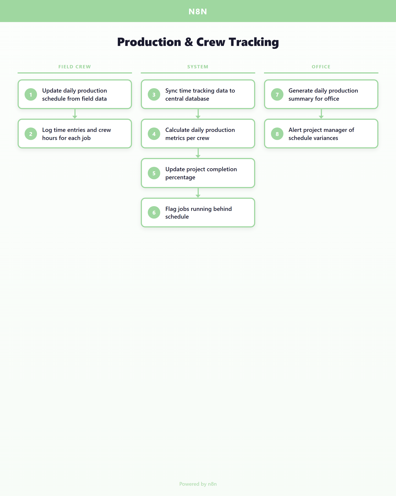 | [Make](posts/production-tracking/make.md) · [Zapier](posts/production-tracking/zapier.md) · [n8n](posts/production-tracking/n8n.md) | Office staff calling crews for updates, production data trapped in text messages and phone calls, no idea which jobs are on track until someone drives to the site, and weekly reports that are already outdated → Time logs and project records are pulled automatically on a schedule, matched against active projects, and synced so the office sees current production data without chasing anyone for updates |
| **Time Tracking** | Time Tracking Sync Engine | 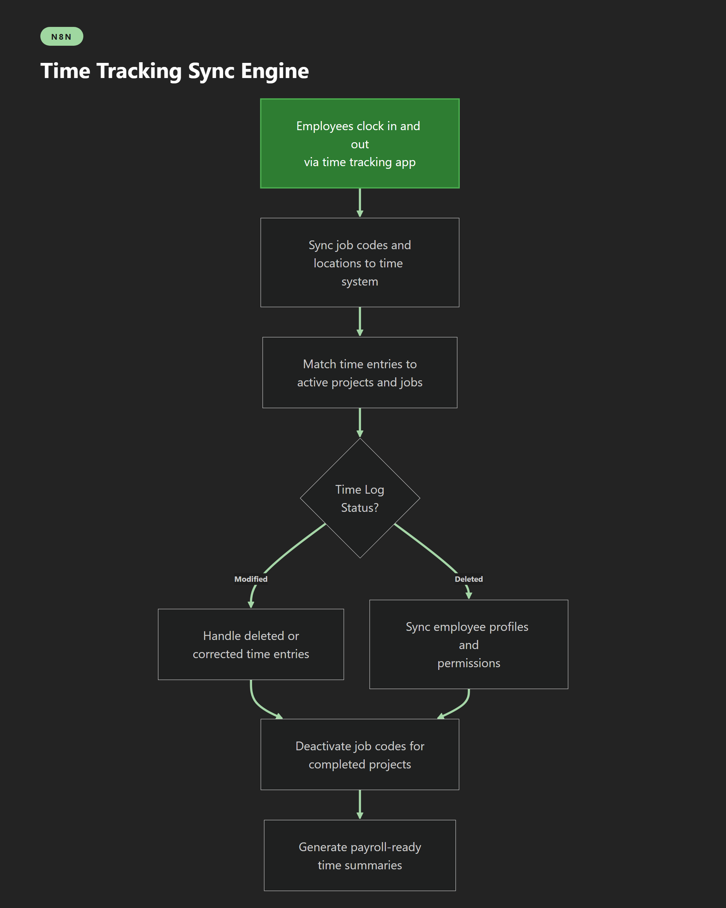 | [Make](posts/time-tracking/make.md) · [Zapier](posts/time-tracking/zapier.md) · [n8n](posts/time-tracking/n8n.md) | Time entries in one app, job codes in another, payroll staff spending hours reconciling who worked where, deleted entries causing phantom hours, and new employees waiting days to be set up in the time system → Every clock-in, correction, and deletion flows between systems as it happens — job codes stay current, employee profiles sync automatically, and payroll gets clean data without manual reconciliation |
| **Invoicing** | Invoice Lifecycle | 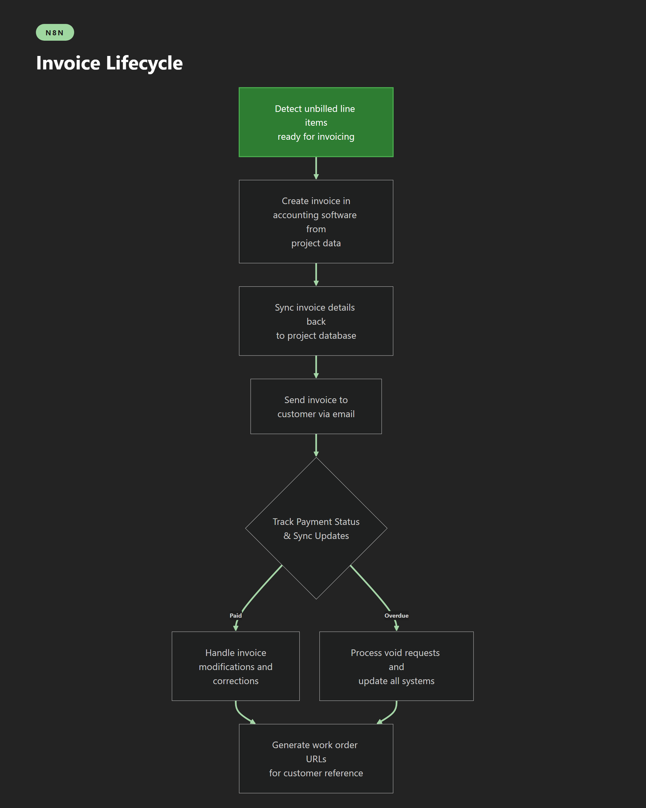 | [Make](posts/invoice-lifecycle/make.md) · [Zapier](posts/invoice-lifecycle/zapier.md) · [n8n](posts/invoice-lifecycle/n8n.md) | Unbilled work slipping through the cracks, invoices created in one system but invisible in another, customers getting outdated versions, and voided invoices still showing up in project dashboards → Unbilled items are detected automatically, invoices flow between accounting and project management as they change, and every modification syncs everywhere |
| **Expense Management** | Expense Management Pipeline | 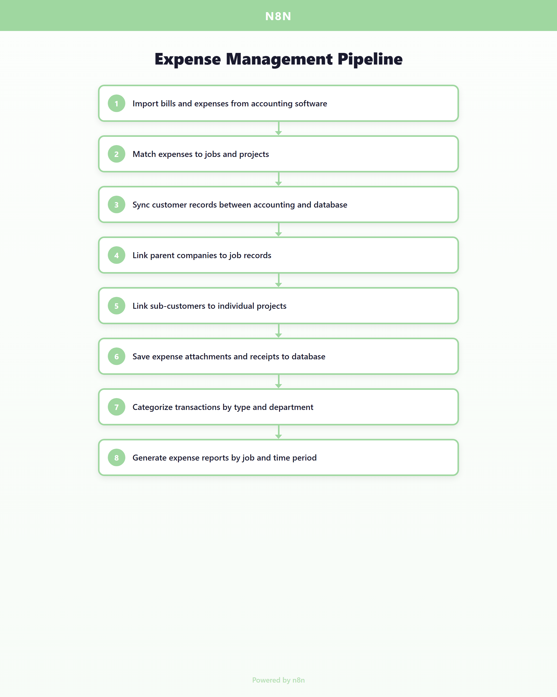 | [Make](posts/expense-management/make.md) · [Zapier](posts/expense-management/zapier.md) · [n8n](posts/expense-management/n8n.md) | Receipts in email, bills in accounting software, project costs in a spreadsheet — nobody can answer "how much did we spend on that job?" without an hour of digging through three different systems → Every bill and receipt is automatically matched to its job by looking up customer references and project records, with attachments downloaded and linked — always-current job costing |
| **Reporting** | Reporting Dashboard Sync | 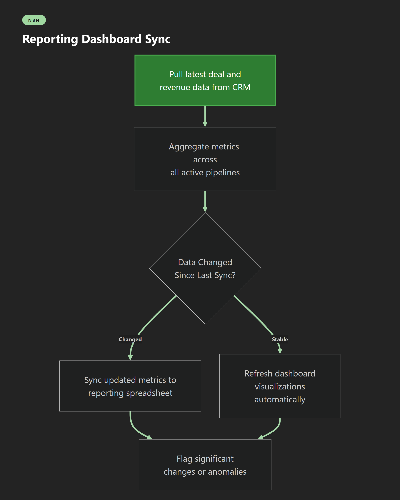 | [Make](posts/reporting-sync/make.md) · [Zapier](posts/reporting-sync/zapier.md) · [n8n](posts/reporting-sync/n8n.md) | Sales managers manually pulling reports from the CRM every Monday, numbers that are already a week old by the time anyone sees them, and no early warning when pipeline health drops → Dashboards refresh every two minutes with live CRM data — deal payloads are generated, deletions are synced, and records are upserted so pipeline numbers are always current |
| **Cross-cutting** | Communication Hub | 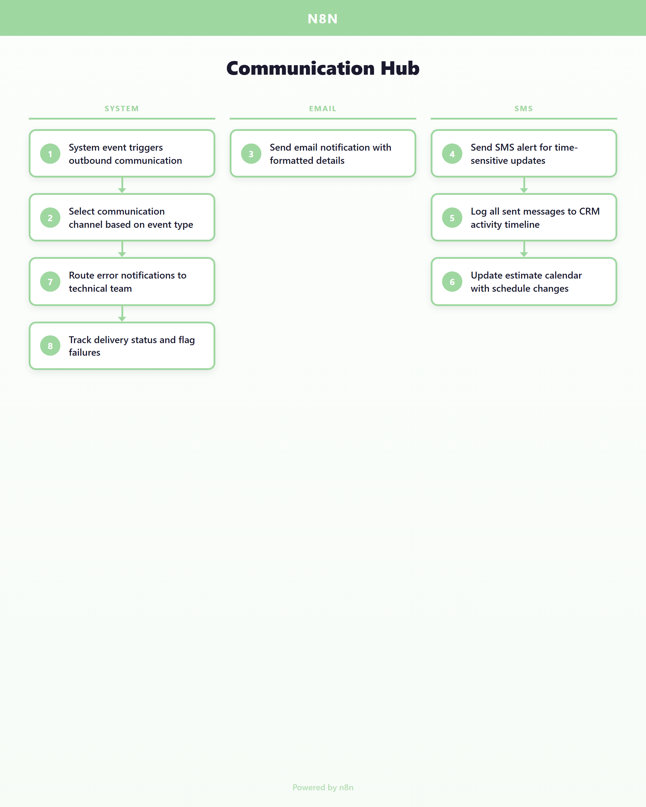 | [Make](posts/communication-hub/make.md) · [Zapier](posts/communication-hub/zapier.md) · [n8n](posts/communication-hub/n8n.md) | Important updates buried in someone's inbox, text messages sent manually that get forgotten during busy days, error notifications that nobody sees, and no record of what was communicated to whom → Every system event automatically triggers the right communication on the right channel — emails, calendar updates, and CRM contact syncs all fire across every connected system |
| **Cross-cutting** | Message Transpiler |  | [Make](posts/message-transpiler/make.md) · [Zapier](posts/message-transpiler/zapier.md) · [n8n](posts/message-transpiler/n8n.md) | Staff manually looking up deals, copying booking links, and shortening URLs before every customer message — slow, error-prone, and impossible to scale during peak season → Every outbound customer message automatically pulls the latest deal context, generates a personalized booking link, shortens it, and routes the right message format |

## How to Use This Portfolio

**Viewing Posts:** Each post is written in markdown format and can be viewed in any markdown reader, GitHub, VS Code, or your preferred text editor. The posts are fully self-contained — read any one independently.

**Platform Versions:** Each workflow is presented in three platform versions (Make, Zapier, n8n). The narrative and business logic are identical across platforms — only the automation tool name changes. Choose the version that matches your preferred tool.

**Diagrams:** Each post includes a 1080×1350 PNG flowchart designed for LinkedIn's portrait aspect ratio. Each platform has its own visual identity:

- **Make:** cream background, pink accent (#E13FA3)
- **Zapier:** cream background, orange accent (#FF4A00)
- **n8n:** dark background with dot grid, mint-green accent (#14E098)

**Sharing:** All posts are standalone and shareable. Link directly to individual markdown files or share the entire portfolio.

## Methodology

**Source Material:** These workflows are based on real Prismatic integration YAML exports from an operational home service company. The processes represent actual business operations that ran in production.

**Curation Process:** Raw YAML workflows were parsed flow-by-flow, processes grouped by source system with unique per-file identifiers, and related processes bundled into business capabilities. Each bundle represents a complete workflow (e.g. "Lead Capture & Qualification" or "Invoice Lifecycle") and carries its own pain/solution narrative grounded in the actual flow data.

**Content Generation:** Per bundle, a single Claude API call produces a `storyBeats` narrative spine — a 5-8 beat structure with headline, dek, and per-beat labels/details. A second call per bundle generates all three platform posts (Make, Zapier, n8n) in one response, keeping voice consistent across variants. Post and diagram are both rendered from the same `storyBeats`, so they tell the exact same story at the reader.

**Diagram Generation:** Each diagram is a bespoke HTML/CSS layout rendered to PNG via Playwright at 1080×1350 @2× resolution. No Mermaid, no flowchart-generator aesthetic — editorial typography (Fraunces display serif, Inter body) with per-platform color palettes. The pipeline lives in the `_pipeline/` subfolder: `lib/diagram-renderer.js` is the template + renderer, driven by `data/storybeats.json` and `scripts/render-story-diagrams.js`.

**Anti-Hallucination Guards:** Source-field forbidden-term scrubbing, structured JSON output via Claude `tool_use`, retry-and-steer loop on any generation containing banned tokens, unique-per-source-file process IDs to prevent silent bundle contamination. Details in `_pipeline/.planning/phases/15-*-SUMMARY.md` (if archived with the repo).

**Tool Naming:** Only Make, Zapier, n8n, HubSpot, and Airtable are named explicitly. All other tools use generic labels ("estimating tool", "time tracking app", "accounting software", "appointment scheduler") to keep posts broadly applicable to any home service operator.

All pipeline code lives in `_pipeline/` for reference and reproducibility. Adding a new Prismatic YAML to the pipeline is a two-step registration documented in `../Processed/README.md`.

---

*Generated from real operational workflows.*
